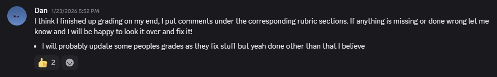
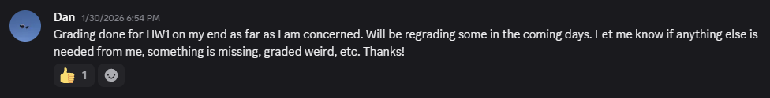
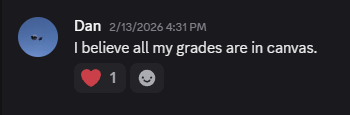
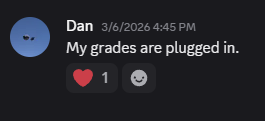
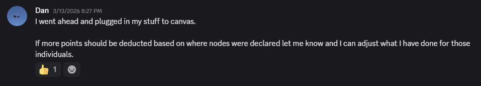
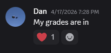
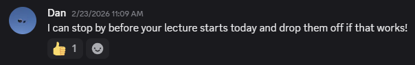

# Career Development Experience #2
This repository aims to fulfill one of the assignments for CPTS 427 @ Washington State University. Assignment being completed: CYA-2.

## Chosen Adventure: Stretch goal in my current role
For this *adventure*, I selected the option to take on and document a stretch goal while already employed. I currently serve as a TA for CPTS 321, and this CYA focuses on measurable impact through faster grading turnaround and flexible follow-up support for students.

### Career Goals

**Short-term**

* Improve technical communication with students
* Build stronger mentoring habits in instructional settings

**Long-term**

* Become a collaborative software engineer with strong communication skills
* Continue mentoring through code review, onboarding, and feedback practices

### My Approach

* Define a truth-first stretch goal with verifiable outcomes
* Prioritize fast grading turnaround windows when possible
* Offer follow-up discussions for clarification and point recovery
* Document impact with written reports and redacted artifacts

### Results At A Glance

* `6` homework grading windows completed in under 24 hours (`HW0`, `HW1`, `HW3`, `HW4`, `HW5`, `HW9`)
* `1` midterm grading cycle returned by the following Monday (`MT1`)
* `>15` estimated follow-up or point-recovery interactions (from private correspondence)
* `~7` estimated additional follow-up hours (about 30-60 minutes per week across ~10 weeks)
* `~11` estimated additional hours total, including follow-up support and extra turnaround effort

### Deliverable Materials

### Artifact Highlights

These images show quick grading status updates and fast turnaround communication. They support the measurable-impact claims in this repository. Where exact logs are private (student correspondence), estimates are explicitly marked and explained in the written deliverables.
